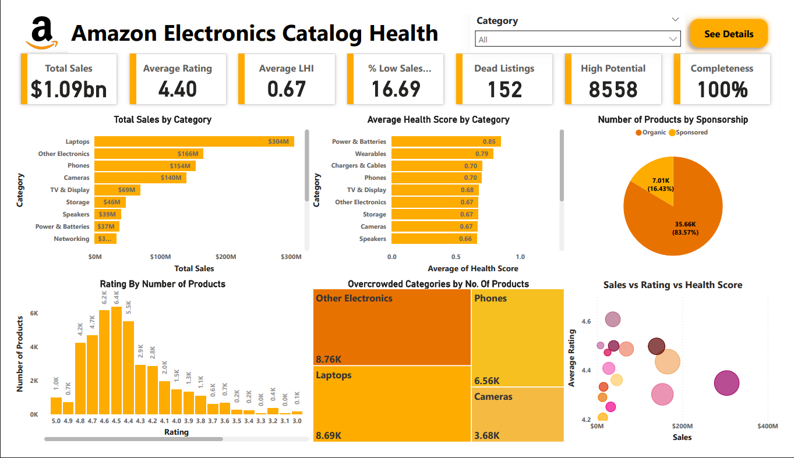

# Amazon Bend the Curve – Product Catalog Analysis

## Executive Summary
This project analyzes **Amazon's product catalog** to evaluate listing performance and identify actionable insights. Using **Python for data exploration, cleaning, and metrics**, and **Power BI for interactive visualization**, I derived key insights into product health, sales, and category performance. 

**Dashboard & Files:**  
- [Power BI Dashboard (.pbix)](./dashboard/Amazon_Bend_The_Curve.pbix)  
- [Dashboard PDF](./dashboard/Amazon_Bend_The_Curve.pdf)
- [Live Dashboard](https://app.powerbi.com/groups/me/reports/9a455ef1-ec83-4d15-83e1-91c0b316cfe5?ctid=a56be167-9ffb-4100-a624-ae3e45045aa6&pbi_source=linkShare&bookmarkGuid=5b913904-16b1-42d2-bfa6-57a4059004c3)

## Business Problem
Amazon’s catalog contains thousands of products, but not all drive revenue effectively.  
**Amazon: Bend the Curve** challenge – identify **underperforming listings, dead products, and high-potential opportunities** for catalog optimization.

## Methodology
- **Data Exploration (EDA):** Inspect columns, distributions, nulls  
- **Data Cleaning:** Fill missing values, correct types, cap outliers  
- **Metrics Engineering:** Sales Score, Rating Score, Return Rate Score, Completeness Score → Health Score  
- **Analysis:** Aggregate by category, identify dead listings, overcrowded categories, high-potential products  

## Skills & Tools
- **Python:** `pandas`, `numpy`, `matplotlib` – EDA, cleaning, outlier handling, metrics calculation  
- **Power BI:** Interactive dashboard, bar charts, scatter plots, heatmaps, pie charts  
- **Business Analysis:** Catalog optimization, KPI-driven insights, sales strategy  

## Results & Business Recommendations
**Insights from analysis:**  
- **Dead Listings:** 152 products (low rating + no sales)  
- **Overcrowded Categories:** Laptops, Other Electronics, Cameras, TV & Display  
- **High-Potential Listings:** 8558 products (criteria: high rating + moderate sales + low competition)  
- **Average Health Score:** 0.68 (42675 products)  
- **Average Rating:** 4.4 / 5

**Recommendations for Amazon:**  
- Promote high-rating, moderate-sales products for ROI  
- Improve listing **completeness** for discoverability  
- Optimize or remove **dead listings** to save resources  
- Focus marketing/pricing strategies on **overcrowded categories**  

## Next Steps
- Track temporal **sales trends** and seasonal patterns  
- Perform **A/B testing** on listings and promotions  
- Explore **predictive modeling** for sales and return rates  
- Continuous monitoring of **catalog health** for actionable insights  
